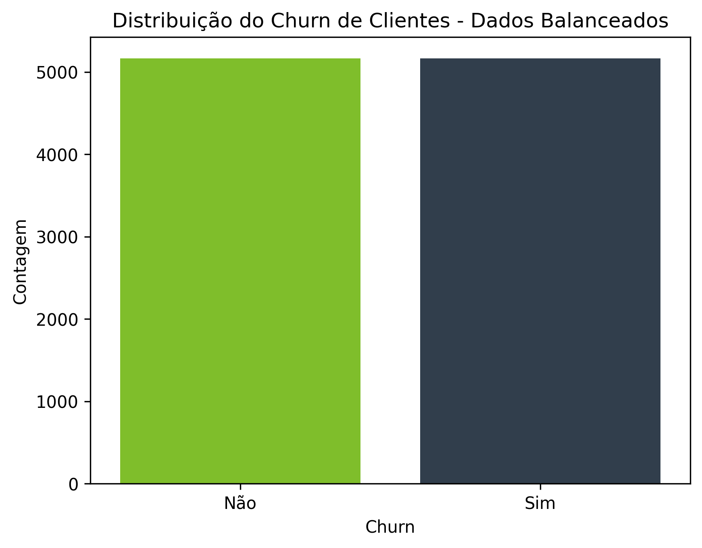

# Telecom-X: Previsão de Evasão de Clientes

Este projeto utiliza técnicas de ciência de dados para prever o churn (evasão) de clientes de uma operadora de telecomunicações. O objetivo é identificar os principais fatores que influenciam a saída dos clientes e propor estratégias para aumentar a retenção.


## Estrutura do Projeto

- `telecom-x_BR.ipynb`: Notebook principal com todo o fluxo de análise, modelagem e visualizações.
- `TelecomX_Dados_Limpos.csv`: Arquivo CSV com os dados tratados e prontos para análise.
- `img/`: Pasta com gráficos e visualizações gerados durante a análise.


## Preparação dos Dados

1. **Classificação das Variáveis**
   - **Categóricas**: Exemplo — gênero, contrato, método de pagamento, serviços adicionais.
   - **Numéricas**: Exemplo — tempo de contrato, cobrança total.

2. **Codificação e Normalização**
   - Variáveis categóricas são codificadas com `OneHotEncoder`.
   - Variáveis numéricas são normalizadas com `StandardScaler`.

3. **Balanceamento**
   - Utilização do SMOTE para equilibrar as classes de churn.

4. **Separação dos dados**
   - Divisão em conjuntos de treino e teste (70% treino, 30% teste) para garantir avaliação justa dos modelos.

**Justificativas**
   - Codificação facilita o uso dos algoritmos de machine learning.
   - Normalização melhora o desempenho dos modelos lineares.
   - Balanceamento evita viés para a classe majoritária.


## Análise Exploratória (EDA)

- Distribuição do churn antes e depois do balanceamento:
  <p align="center">
    
    
  </p>

- Relação entre cobrança total, tempo de contrato e churn:
  <p align="center">
    
    
  </p>

**Principais insights:**
- Clientes com contratos mais longos tendem a permanecer.
- Cobranças elevadas aumentam o risco de churn.
- O recebimento de fatura digital e o perfil familiar (idosos, dependentes, cônjuge) influenciam a evasão.


## Modelagem

- ### **Avaliação**:
  - Métricas: acurácia, precisão, recall, F1-score, AUC-ROC.
  - Random Forest apresentou melhor desempenho (acurácia de 82%, AUC-ROC de 0.90).

- ### **Principais variáveis**:
  - Tempo de contrato
  - Valor total cobrado
  - Fatura digital
  - Perfil familiar (idosos, dependentes, cônjuge)


  Relacionamento das principais variáveis com o churn
  <p align="center">
  
  
</p>

### **Modelos utilizados**:
- **Regressão Logística**
- **Random Forest**

### Avaliação

- Métricas: acurácia, precisão, recall, F1-score, AUC-ROC.
- O modelo Random Forest apresentou melhor desempenho:  
  **Acurácia:** 82%  
  **AUC-ROC:** 0.90

### Principais Variáveis Identificadas

- **Tempo de contrato:** Quanto maior, menor o risco de churn.
- **Valor total cobrado:** Cobranças mais altas aumentam o risco de churn.
- **Fatura digital:** Clientes que recebem fatura digital têm maior propensão à evasão.
- **Perfil familiar:** Idosos, clientes com dependentes ou cônjuge tendem a permanecer mais.

#### Importância das variáveis no Random Forest

<p align="left">
    
</p>


**Recomendações de Retenção**
   - Oferecer benefícios para contratos mais longos.
   - Revisar políticas de cobrança.
   - Acompanhar clientes que recebem fatura digital.
   - Valorizar perfis familiares com programas de fidelidade.

## Como executar

1. Instale as dependências:
   ```
   pip install pandas seaborn matplotlib scikit-learn imbalanced-learn statsmodels
   ```
2. Certifique-se de que o arquivo `TelecomX_Dados_Limpos.csv` está na mesma pasta do notebook.
3. Abra o arquivo `telecom-x_BR.ipynb` no Jupyter Notebook ou VS Code.
4. Execute as células em ordem para reproduzir toda a análise.


## Resultados

- O modelo Random Forest foi o mais eficiente para prever churn.
- Fatores financeiros e familiares são os principais influenciadores da evasão.
- Estratégias de retenção baseadas nesses fatores podem aumentar a fidelização dos clientes.